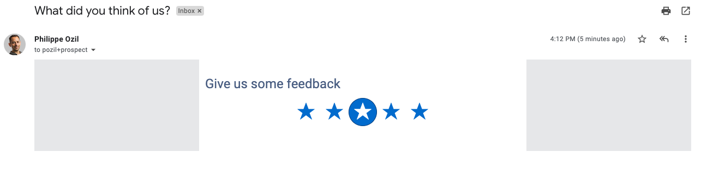
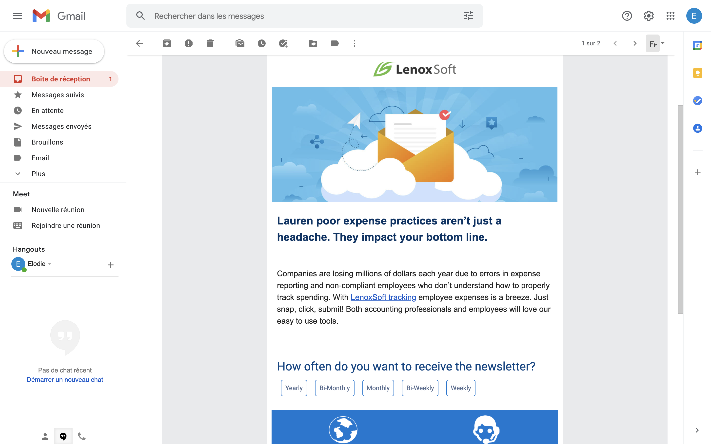
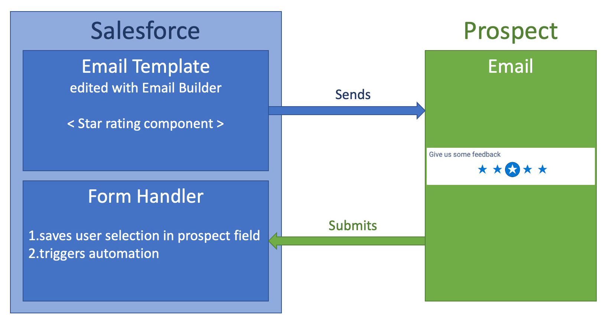
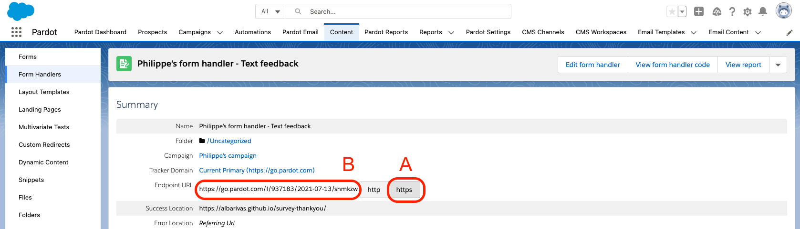
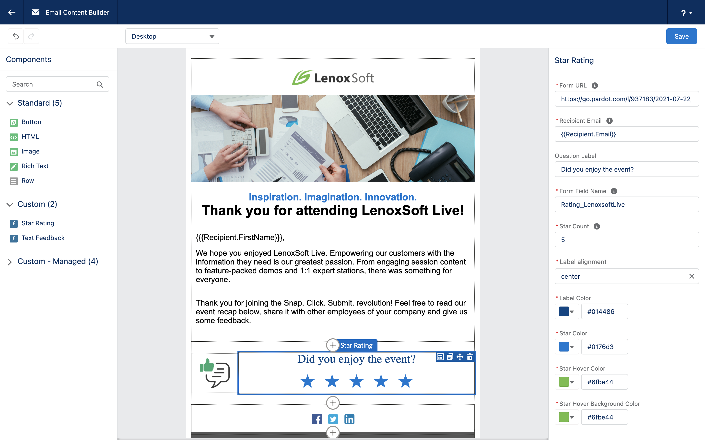
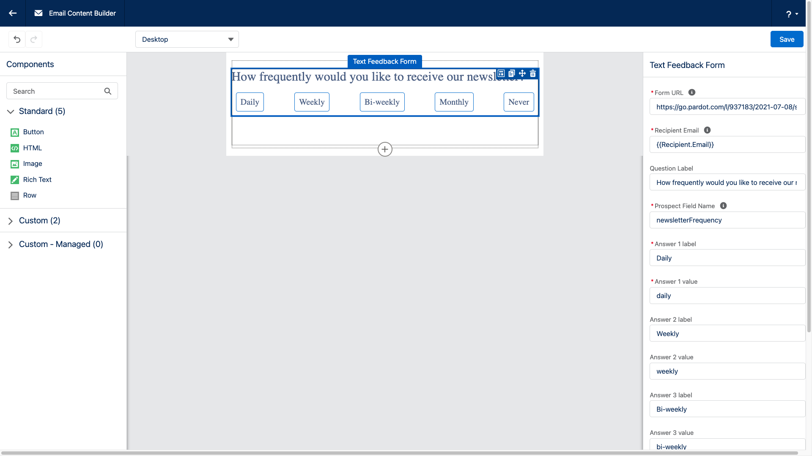

# Embedded Feedback within Pardot Emails

Gather instant feedback from prospects within Pardot Emails.

<table>
   <tr>
      <td width="50%">
         
      </td>
      <td>
         
      </td>
   </tr>
</table>

1. [About](#about)
1. [Installation](#installation)
1. [Documentation](#documentation)
1. [Component Reference](#component-reference)
   1. [Star Rating Component](#star-rating-component)
   1. [Text Feedback Component](#text-feedback-component)

## About

Embed a feedback form within your Pardot emails to gather instant and direct feedback from your prospects. Ask them about their interests or understand if they like your content (webinar, whitepaper).

This project contains Lightning Web Components that can be used with Pardot's Email Builder:

- a **Star Rating** component with any number of stars (default: 5).
- a **Text Feedback** component with up to 5 text field options.

Once the email is sent, prospects can then select and submit their answers directly from within the email. Answers are sent to a Pardot Form Handler that saves responses in a Prospect field and optionally triggers some admin-defined actions (re-scoring...).

## Installation

Before installing, check for these prerequisites:

- You must be a Salesforce Administrator
- You must be a Pardot Administrator
- The Pardot setup must be completed and the connector with Salesforce active

Install the components though the AppExchange (recommended) or deploy this project's metadata (for development purposes).

## Documentation

### Create the fields to store the answers

1. In Salesforce, open **Setup** and **Object Manager**
2. Create custom fields on the Lead or Contact object (or both).
3. Map the newly created fields in Pardot by navigating to **Pardot > Pardot Settings > Object & Fields Configuration > Prospect Fields > Add Custom Fields**

### Create a Form Handler

Create a [Form Handler](https://help.salesforce.com/articleView?id=sf.pardot_form_handlers.htm&type=5) for each question you wish to add in the template

1. Navigate to **Pardot > Content > Form Handlers**
1. Click **Add form Handler**
1. Enter a name
1. Attach it to a campaign
1. Check **Kiosk/Data Entry Mode**
1. Specify a URL for the **Success Location**. This is a URL that should leads to a landing page that says "Thank You".
1. Add a **Form Field** mapping:

   - **External Field Name** is the name of the field that will be specified in your component later.
   - **Prospect Field** is the field where the information will be saved.
   - **Data Format** can be left as `Text` or optionally switched to `Number` if using the star rating component.

1. Once your form handler is saved, switch **Endpoint URL** to `https` (A) and copy the URL (B). You will need the URL when configuring the Email Builder component.

   

1. Create an **Email Content** record.
1. In your Email Content record, click **Edit in Builder**.
1. Expand the **Custom - Managed** components section on the left and drag and drop one of the feedback form components on your email template.
1. Refer to the [Component Reference](#component-reference) section of this document for configuration guidance.

## Component Reference

### Star Rating Component

 

<b> Click here for screenshots 🖼</b>

     
    

    

 

| Property                        | Description                                                                                                                                       |
| ------------------------------- | ------------------------------------------------------------------------------------------------------------------------------------------------- |
| **Form URL**                    | HTTPS endpoint URL of your Form Handler that you copied earlier.                                                                                  |
| **Recipient Email**             | Email address of the prospect. Leave the default value `{{Recipient.Email}}`, Pardot will automatically inject the relevant values in emails. |
| **Question Label**              | An optional label for the component.                                                                                                              |
| **Form Field Name**             | This value must match the **External Field Name** value that you configured in your Form Handler.                                                 |
| **Star Count**                  | The number of stars that will be displayed in the email.                                                                                          |
| **Label Alignment**             | Horizontal alignment of the label: left, center or right.                                                                                         |
| **Label Color**                 | Font color for label.                                                                                                                             |
| **Star Color**                  | Default star fill color.                                                                                                                          |
| **Star Hover Color**            | Star fill color when user hovers with cursor. Previewed unavailable in Email Builder (hover disabled), use the email template preview.            |
| **Star Hover Background Color** | Star background color when user hovers with cursor. Previewed unavailable in Email Builder (hover disabled), use the email template preview.      |

### Text Feedback Component

 

<b> Click here for screenshots 🖼</b>

     
    

    

 

**Tips:**

- The component supports up to five answers.
- Answers with no label and values will not be displayed

| Property                          | Description                                                                                                                                       |
| --------------------------------- | ------------------------------------------------------------------------------------------------------------------------------------------------- |
| **Form URL**                      | HTTPS endpoint URL of your Form Handler that you copied earlier.                                                                                  |
| **Recipient Email**               | Email address of the prospect. Leave the default value `{{Recipient.Email}}`, Pardot will automatically inject the relevant values in emails. |
| **Question Label**                | An optional label for the component.                                                                                                              |
| **Form Field Name**               | This value must match the **External Field Name** value that you configured in your Form Handler.                                                 |
| **Answer x Label**                | Label for one of the x links displayed in the email.                                                                                              |
| **Answer x Value**                | Value associated to one of the x links displayed in the email. This is what gets sent to the form handler.                                        |
| **Label Alignment**               | Horizontal alignment of the label: left, center or right.                                                                                         |
| **Label Color**                   | Font color for label.                                                                                                                             |
| **Button Text Color**             | Default button text color.                                                                                                                        |
| **Button Background Color**       | Default button background color.                                                                                                                  |
| **Button Border Color**           | Default button border color.                                                                                                                      |
| **Button Hover Text Color**       | Button text color when user hovers with cursor. Previewed unavailable in Email Builder (hover disabled), use the email template preview.          |
| **Button Hover Background Color** | Button background color when user hovers with cursor. Previewed unavailable in Email Builder (hover disabled), use the email template preview.    |
| **Button Hover Border Color**     | Button border color when user hovers with cursor. Previewed unavailable in Email Builder (hover disabled), use the email template preview.        |
